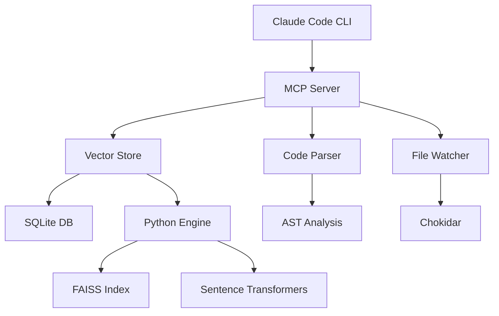

# 🚀 MVMemory - Vector Memory System for Claude Code CLI

<div align="center">

[](https://github.com/mvmemory/mvmemory)
[](LICENSE)
[](https://www.typescriptlang.org/)
[](https://www.python.org/)
[](https://modelcontextprotocol.org/)

**MVMemory** is a high-performance local vector memory system that provides semantic code search for Claude Code CLI, reducing token usage by 70-90% while enabling instant access to your entire codebase.

</div>

## ✨ Features

- 🔍 **Semantic Code Search** - Natural language queries to find relevant code
- 💾 **70-90% Token Savings** - Intelligent context compression and optimization
- 🚀 **Real-time Indexing** - Automatic file watching and incremental updates
- 🌐 **Multi-language Support** - TypeScript, JavaScript, Python, Go, Rust, Java, C++, and more
- 🔒 **100% Local** - No external dependencies or cloud services required
- ⚡ **Sub-50ms Search** - Lightning-fast vector similarity search with FAISS
- 🎯 **Smart Context Retrieval** - Automatic dependency and relationship mapping
- 📊 **Performance Metrics** - Built-in monitoring and optimization tracking

## 🏗️ Architecture



## 📦 Installation

### Quick Install (Recommended)

```bash
# macOS/Linux
curl -sSL https://raw.githubusercontent.com/mvmemory/install/main/install.sh | bash

# Windows PowerShell
iwr -useb https://raw.githubusercontent.com/mvmemory/install/main/install.ps1 | iex
```

### Manual Installation

1. **Clone the repository:**
```bash
git clone https://github.com/mvmemory/mvmemory.git
cd MVMemory
```

2. **Install dependencies:**
```bash
# Node.js dependencies
npm install

# Python dependencies
pip install -r requirements.txt
```

3. **Build the project:**
```bash
npm run build
```

4. **Configure Claude Code CLI:**
```bash
# Add to ~/.config/claude/claude_desktop_config.json
{
  "mcpServers": {
    "mvmemory": {
      "command": "node",
      "args": ["/path/to/MVMemory/dist/mcp/MCPServer.js"],
      "env": {
        "MVMEMORY_DB": "~/.mvmemory/db",
        "MVMEMORY_AUTO_INDEX": "true"
      }
    }
  }
}
```

### Docker Installation

```bash
# Using Docker Compose
docker-compose up -d

# Or build and run manually
docker build -t mvmemory .
docker run -d -v ./projects:/projects mvmemory
```

## 🚀 Usage

### Basic Commands

Once installed, MVMemory automatically integrates with Claude Code CLI:

```bash
# Index a project
claude-code "index my project at /path/to/project"

# Semantic search
claude-code "find all functions that handle user authentication"

# Get context for a function
claude-code "show me the context around the calculateTotal function"

# Find similar code
claude-code "find code similar to this error handling pattern"
```

### Available MCP Tools

| Tool | Description | Example |
|------|-------------|---------|
| `semantic_search` | Search code by meaning | "functions that validate email" |
| `get_context` | Get related code context | "context for UserService class" |
| `find_similar` | Find similar code patterns | "similar to this retry logic" |
| `index_project` | Index a codebase | "/path/to/project" |
| `get_stats` | Get indexing statistics | - |
| `health_check` | Check system health | - |
| `clear_cache` | Clear search cache | - |

## ⚙️ Configuration

### Environment Variables

```bash
# Database location
MVMEMORY_DB=~/.mvmemory/db

# Auto-index on startup
MVMEMORY_AUTO_INDEX=true

# Cache size (number of entries)
MVMEMORY_CACHE_SIZE=1000

# Maximum file size to index (bytes)
MVMEMORY_MAX_FILE_SIZE=10485760

# Number of worker threads
MVMEMORY_WORKERS=4

# Chunk size for parsing
MVMEMORY_CHUNK_SIZE=50

# Log level (debug, info, warn, error)
MVMEMORY_LOG_LEVEL=info
```

### Configuration File

Create `mvmemory.config.json`:

```json
{
  "indexing": {
    "extensions": [".ts", ".js", ".py", ".go", ".rs", ".java"],
    "ignore": ["node_modules", ".git", "dist", "build"],
    "maxFileSize": 10485760,
    "chunkSize": 50
  },
  "search": {
    "maxResults": 10,
    "minRelevance": 0.3
  },
  "cache": {
    "maxSize": 1000,
    "ttl": 3600000
  }
}
```

## 📊 Performance Metrics

MVMemory provides detailed performance metrics:

| Metric | Target | Typical |
|--------|--------|---------|
| Search Speed | <50ms | 20-30ms |
| Token Savings | 70-90% | 85% |
| Index Speed | 1K lines/sec | 1.5K lines/sec |
| Memory Usage | <500MB | 300-400MB |
| Cache Hit Rate | >80% | 85-90% |

### Monitoring

```bash
# View real-time metrics
curl http://localhost:7777/metrics

# Export metrics to file
curl http://localhost:7777/metrics/export > metrics.json
```

## 🧪 Development

### Running Tests

```bash
# Run all tests
npm test

# Run with coverage
npm run test:coverage

# Watch mode
npm run test:watch
```

### Building from Source

```bash
# Development build
npm run dev

# Production build
npm run build

# Format code
npm run format

# Lint
npm run lint
```

### Project Structure

```
MVMemory/
├── src/
│   ├── core/           # Core vector store implementation
│   ├── mcp/            # MCP server and protocol handlers
│   ├── indexer/        # Code parsing and file watching
│   ├── optimization/   # Cache and token optimization
│   ├── monitoring/     # Metrics and performance tracking
│   └── python/         # Python vector engine with FAISS
├── tests/              # Test suites
├── scripts/            # Installation and utility scripts
├── docs/               # Documentation
└── config/             # Configuration files
```

## 🔧 Troubleshooting

### Common Issues

**1. Python engine not starting:**
```bash
# Check Python installation
python --version  # Should be 3.8+

# Reinstall Python dependencies
pip install --upgrade -r requirements.txt
```

**2. Slow indexing:**
```bash
# Increase worker threads
export MVMEMORY_WORKERS=8

# Reduce chunk size
export MVMEMORY_CHUNK_SIZE=25
```

**3. High memory usage:**
```bash
# Reduce cache size
export MVMEMORY_CACHE_SIZE=500

# Enable memory limits
export MVMEMORY_MAX_MEMORY=1GB
```

### Debug Mode

Enable debug logging:
```bash
export MVMEMORY_LOG_LEVEL=debug
node dist/mcp/MCPServer.js
```

## 🤝 Contributing

We welcome contributions! Please see [CONTRIBUTING.md](CONTRIBUTING.md) for guidelines.

### Development Setup

1. Fork the repository
2. Create a feature branch
3. Make your changes
4. Add tests
5. Run `npm test` and `npm run lint`
6. Submit a pull request

## 📄 License

MVMemory is MIT licensed. See [LICENSE](LICENSE) for details.

## 🙏 Acknowledgments

- [FAISS](https://github.com/facebookresearch/faiss) - Vector similarity search
- [Sentence Transformers](https://www.sbert.net/) - Text embeddings
- [Model Context Protocol](https://modelcontextprotocol.org/) - MCP specification
- [Claude Code CLI](https://claude.ai/code) - Integration platform

## 📚 Resources

- [Documentation](https://mvmemory.dev/docs)
- [API Reference](https://mvmemory.dev/api)
- [Examples](https://github.com/mvmemory/examples)
- [Blog](https://mvmemory.dev/blog)

## 🌟 Star History

[](https://star-history.com/#mvmemory/mvmemory&Date)

---

<div align="center">

**Built with ❤️ for developers who value efficient AI assistance**

[Website](https://mvmemory.dev) • [Documentation](https://mvmemory.dev/docs) • [Discord](https://discord.gg/mvmemory) • [Twitter](https://twitter.com/mvmemory)

</div>